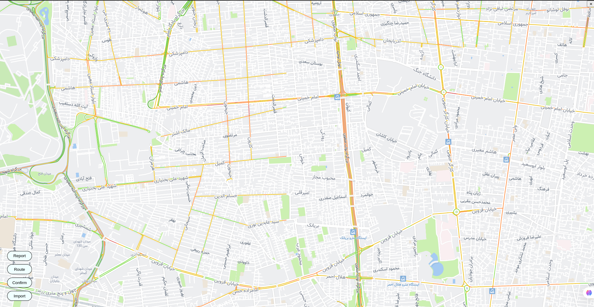
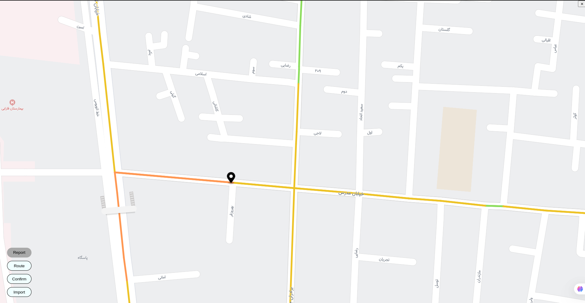
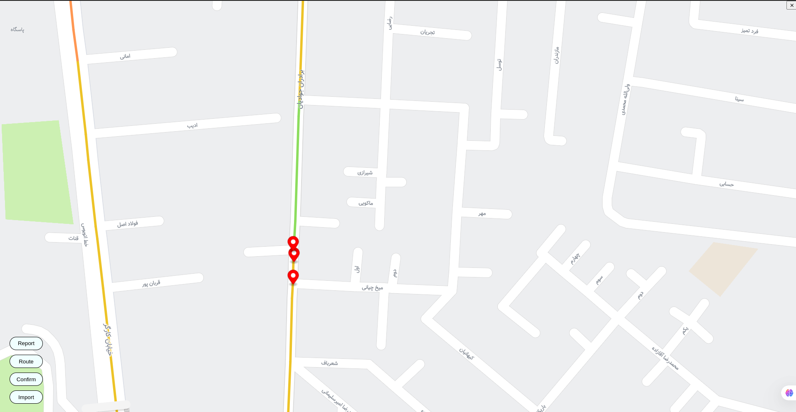
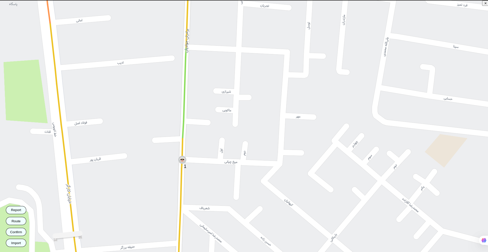
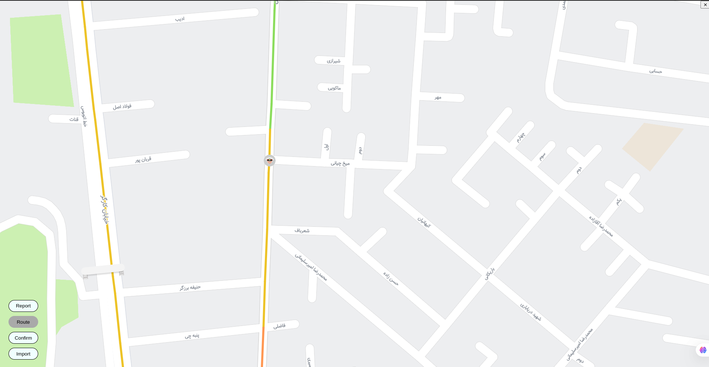
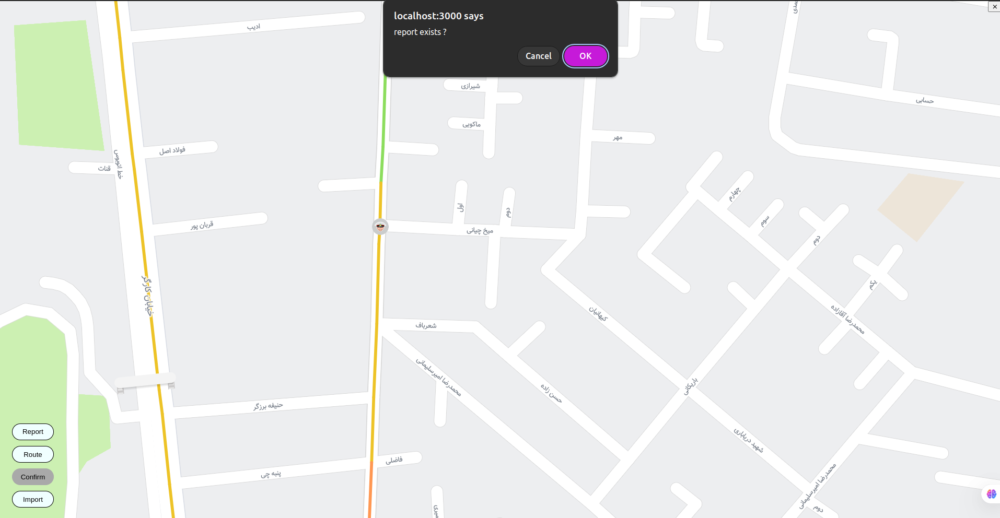
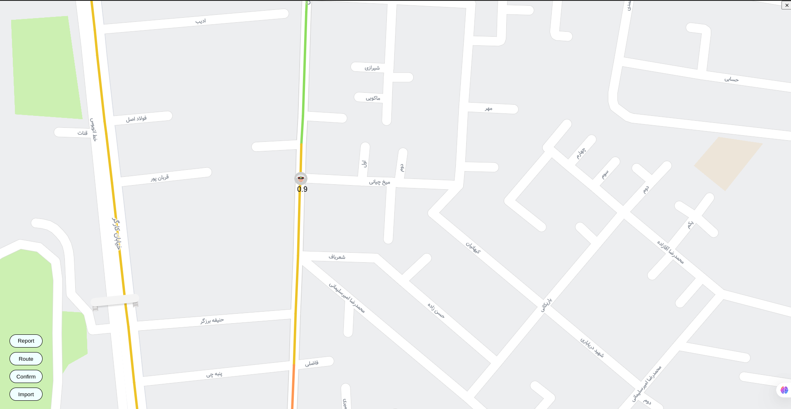

# Project Overview
This project provides a microservices-based platform for crowdsourced navigation and data aggregation. It comprises the following services:

Navigation Service: Routes users to their destinations using OSRM.

Crowdsourcing Service: Collects real-time user feedback and location data.

Aggregation Service: Processes and clusters the collected crowdsourced data using the Louvain community detection algorithm.

OSRM Service: Provides high-performance routing via the hamirho/osrm:trafficless Docker image.

Authentication Service: Secures API endpoints and manages user identities (ensure this is running or reachable).

# 🚀 Features
Real-time route calculation with OSRM.

Crowdsourced data collection for traffic, POIs, and user feedback.

Graph-based clustering of crowdsourced events using Louvain.

Modular microservices architecture for scalability and maintainability.

Out-of-the-box Docker support using Docker Compose.

# 📦 Technologies
Docker & Docker Compose for containerization.

Go / Python (service-specific stacks).

OSRM for routing engine.

Louvain algorithm for community detection.

RESTful APIs for inter-service communication.

# 🛠 Prerequisites
Docker Engine (>= 20.10)

Docker Compose (>= 1.29)

(Optional) A running Authentication Service exposing a REST API

# 🔧 Installation & Setup
1. Clone the Repository
```
git clone https://github.com/ECTLab/Crowdsourcing-Platform.git
cd Crowdsourcing-Platform
```
2. Download the OSM Map of Iran
Before running the services, download the required OpenStreetMap data by executing the following script:
```
sh download_map.sh
```
This will download and place the Iran OSM map on your system.

3. Build and Start All Services
```
docker-compose up --build
```
This command will:

Build navigation, crowdsourcing, and aggregation from local Dockerfiles

Pull and run the OSRM image (hamirho/osrm:trafficless)

Start all containers in detached mode

4. Verify the Services

```
docker-compose ps
```
You should see:

navigation listening on port 8080

crowdsourcing listening on port 8081 (container port 8080)

osrm listening on port 5000

aggregation restarting on exit to process new data

redis running on port 6379


# 🖥️ Using the Web UI
1. Access the Interface
Once all services are up, open your browser and navigate to:

```
http://localhost:3000
```



2. Submit a Report
Zoom in to a specific road or street on the map.

Click on two points along the road to define the route.

⚠️ Ensure the two points are not too far apart — otherwise, the server will reject the report.


3. Import Reports
After submitting a report, click the Import button.

Red pins will appear for reports that are not yet aggregated.



Wait up to 30 seconds, then click Import again to see the aggregated event.

Routes with reported police presence will now include police icons.

4. Confirm or Decline Police Presence
Click the Confirm button to select a police pin on the map.

A dialog will appear to confirm or decline the police presence.


Once confirmed/declined, click Import again to see the updated confidence level.

# 🧮 Aggregation Service & Louvain Algorithm
The Aggregation Service:

Reads crowdsourced event data from the database.

Constructs a graph where nodes represent events/locations and edges represent proximity or similarity.

Applies the Louvain community detection algorithm to identify clusters (communities) of related events.

Outputs cluster assignments or summary statistics for downstream consumption.

Running Aggregation Manually
If you need to trigger aggregation on-demand:

```
docker-compose run --rm aggregation
```
# 📈 Monitoring & Logs

# View live logs
```
docker-compose logs -f
```
# View logs for a single service
```
docker logs -f navigation
```
